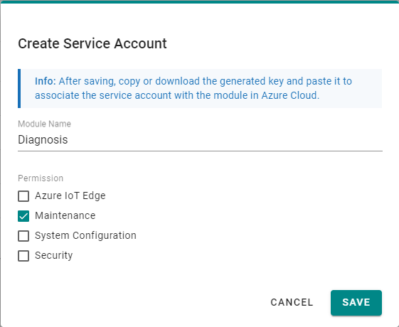
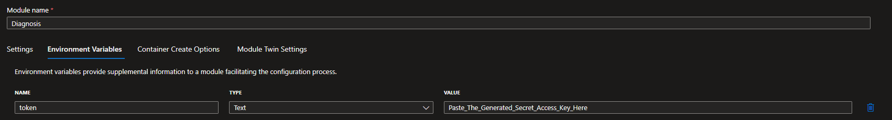

# Moxa Diagnosis Module

Document Version: V1.0

##### Change Log

| Version | Date       | Content                                      |
| ------- | ---------- | -------------------------------------------- |
| 1.0     | 2023-05-19 | Document created                             |

### Purpose

This document guide you how to deploy a diagnosis module on TPE devices and leverage its capabilities to help us debug further.

> Note: The sample code is developed based on AIG-502.

---

### 1. Building the Module

### 2. Deploying the Module

#### 2.1 Important Notice:

1. If you are deploying IoT Edge modules through deployments previously, please modify the device twin to opt-out the unit before adding a new module.
2. Please make sure the traffic consumption of log upload is affordable and the target Azure Storage Account/container is created before enabling the log upload feature.
3. When enabling the log upload feature, please also specify Azure storage connection string and container name. **Same container should not be shared among multiple devices.**
4. This module will save logs in local storage (/home/moxa/log) when upload fails, please monitor the log upload status regularly and call back the unit as soon as anomalies are noticed.

#### 2.2 Deploy the Module from Azure Portal

- Image URL: frankshli/tpe_diagnosis_module:2.0.0-amd64

  > Note: This docker image url allows us to test the module's functionality without having to go through the whole build process. However, it's recommended to build and maintain your own image versions when going into production.

- Container Create Option: 

  ```json
  {
    "HostConfig": {
      "ExtraHosts": [
        "<HOSTNAME>:172.31.0.1"
      ],
      "Binds": [
        "/home/moxa/log:/host/log"
      ]
    }
  }
  ```

- Environment Variables

1. From AIG-502's web GUI, create a service account with `Maintenance` permission granted and copy the secret access key to the clipboard.

    

2. From Azure portal, add an environment variable with name = `token`, type = `Text` and value = `<SECRET_ACCESS_KEY>`

    

---

### 3. Supported Functionalities

#### 3.1 Send Heartbeat Device to Cloud Messages
This module will periodically send out heartbeat messages to edgeHub, which helps us in two ways:

1. Since the messages do not rely on external data sources (such as Modbus), we can expect the message stream to be stable as long as the module keeps running.
2. Once we figured that there are some messages missing, which are supposed to be sent out by other modules (e.g., thingspro-agent), we can compare with the heartbeat messages sent by this module, to tell if the issue belongs to a specific module or the IoT Edge runtime (edgeHub and edgeAgent).

#### 3.2 Collect and Upload log to Azure Storage Account

Once enabled, this module will periodically collect syslog from ThingsPro Edge and upload it to a designated Azure Storage Account specified in the module twin.

#### 3.3 Configure through Module Twin

The supported module twin properties are listed below, we can configure the module through updating desired properties.

| Key                               | Type      | Note                                                  |
| --------------------------------- | --------- | ----------------------------------------------------- |
| upload_log                        | Boolean   | Enable Log Upload                                     |
| azure_blob_connection_string      | string    | Azure storage account's connection string             |
| azure_blob_storage_container      | string    | Container's name within the storage account           |
| log_frequency                     | integer   | Log Upload Frequency (second)                         |
| max_log_count                     | integer   | The maximum log file count that can be kept locally   |
| message_frequency                 | integer   | Heartbeat Message Frequency (second)                  |

Sample:

```json
{
    "upload_log": true,
    "azure_blob_connection_string": "<STORAGE_ACCOUNT_CONNECTION_STRING>",
    "azure_blob_storage_container": "<STORAGE_ACCOUNT_CONTAINER_NAME>",
    "log_frequency": 86400, // seconds
    "max_log_count": 5,
    "message_frequency": 300  // seconds
}
```

#### 3.4 Direct Method

This module supports a direct method name `remove-log`, which removes all the locally kept log files except for the latest one regardless of the payload. 

Direct method calls with other method name will trigger a log upload task once it's received by the module. Method name and payload doesn't matter in this case, but payload must be json formatted.

> Note: Please note that payload must be json formatted even if we are not referencing it. This is a limitation of Azure IoT Python SDK.

---

### 4. Default Settings

| Key                               | Value |
| --------------------------------- | ----- |
| upload_log                        | False |
| azure_blob_connection_string      | NULL  |
| azure_blob_storage_container      | NULL  |
| log_frequency                     | 86400 |
| max_log_count                     | 0     |
| message_frequency                 | 30    |
